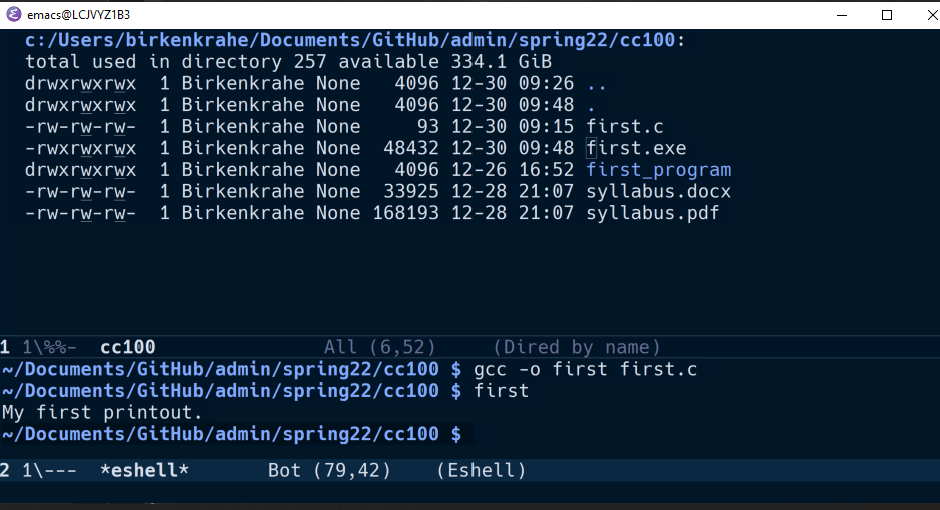

# Org-mode coding assignment

This file contains the first `Org-mode` assignment, and a sample
solution in the programming language C instead of R. The main
challenge is not the programming language but managing the
complexity of writing a "literate" program, which includes layout
like headlines, links, documentation, source code and result
elements. Note that the sample solution also lists relevant
references at the end<a id="fnr.1" class="footref" href="#fn.1">1</a>.

## Assignment

Create an Org-mode file with the following characteristics:

-   A headline (`*`) with the text `My first Org-mode file`.
-   A paragraph that explains what the following code block does.
-   A R source code block. The block should contain one line of code
    only. It should have the name `first_program`:

    #+name: first_program
    #+begin_src [header]
      [statements]
    #+end_src

-   In the header of the source block, replace `[header]` by these arguments:

    :session *R*
    :results output
    :tangle first.R
    :exports both
    :comments both
    :var DATA="mtcars"

-   In the body of the code block, replace the `[statements]` by the command:

    str(DATA)

-   Save the file as `YourName.org` (e.g. `MarcusBirkenkrahe.org`)
-   Upload the file to [this GitHub repo](https://github.com/birkenkrahe/ds205/tree/main/assignments/org-mode): `birkenkrahe/ds205/assignments/org-mode`

## [Example solution in C (not R)](https://github.com/birkenkrahe/cc100/blob/main/2_installation/org_mode_assignment/MarcusBirkenkrahe.org)

-   My first Org-mode file

    -   The function `puts()` prints out a string (text in quotes) to
        the screen.
    -   In the code block, the syntax is highlighted (which colors are
        used exactly depends on the Emacs theme used).
    -   The code block header says:
    
    <table border="2" cellspacing="0" cellpadding="6" rules="groups" frame="hsides">
    
    
    <colgroup>
    <col  class="org-left" />
    
    <col  class="org-left" />
    </colgroup>
    <tbody>
    <tr>
    <td class="org-left"><code>:main yes</code></td>
    <td class="org-left">wrap <code>puts</code> statement in <code>int main(void) { }</code> function</td>
    </tr>
    
    
    <tr>
    <td class="org-left"><code>:includes stdio.h</code></td>
    <td class="org-left">include standard input/output header file</td>
    </tr>
    
    
    <tr>
    <td class="org-left"><code>:tangle first.c</code></td>
    <td class="org-left">export source code as C file <code>first.c</code>  ("tangle")</td>
    </tr>
    
    
    <tr>
    <td class="org-left"><code>:exports both</code></td>
    <td class="org-left">both result and source code will be exported</td>
    </tr>
    
    
    <tr>
    <td class="org-left"><code>:comments both</code></td>
    <td class="org-left">link source code and org files, add comments to source</td>
    </tr>
    
    
    <tr>
    <td class="org-left"><code>:results raw</code></td>
    <td class="org-left">insert output directly in org format into org file</td>
    </tr>
    </tbody>
    </table>
    
        
        puts("My first printout.");
    
    My first printout.
    My first printout.

### Executing the program on the command line

In Emacs (provided the C compiler `gcc` is available and in the `PATH`):

    M-x eshell
    gcc -o first first.c

See screenshot: buffer 1 shows folder with `first.c` file, buffer
2 shows shell compilation and execution of `first.exe`.

### References

-   GCC, the GNU Compiler Collection. [URL: gcc.gnu.org.](https://gcc.gnu.org)
-   GitHub: software hosting platform. [URL: github.com](https://github.com).
-   Kernighan, Brian W.; Ritchie, Dennis M. (February 1978). The C
    Programming Language (1st ed.). Englewood Cliffs, NJ: Prentice
    Hall. ISBN 0-13-110163-3. [URL: archive.org](https://archive.org/details/TheCProgrammingLanguageFirstEdition).
-   `mtcars`: Motor Trend Car Road Tests. [URL: rdocumentation.org](https://www.rdocumentation.org/packages/datasets/versions/3.6.2/topics/mtcars).
-   R Core Team (2021). R: A language and environment for statistical
    computing. R Foundation for Statistical Computing, Vienna, Austria.
    [URL: r-project.org](https://r-project.org).
-   `str`: Compactly Display the Structure of an Arbitrary R
    Object. [URL: rdocumentation.org](https://www.rdocumentation.org/packages/utils/versions/3.6.2/topics/str).
-   tecosaur (n.d.). The Org Manual: 16 Working with Source Code
    [website]. [URL: orgmode.org](https://orgmode.org/manual/Working-with-Source-Code.html).

# Footnotes

<a id="fn.1" href="#fnr.1">1</a> The references have URLs, and these URLs have inline links. To
add a link in GNU Emacs Org-mode, use the key sequence `C-x C-l [link]
RET` (~org-insert-link).
